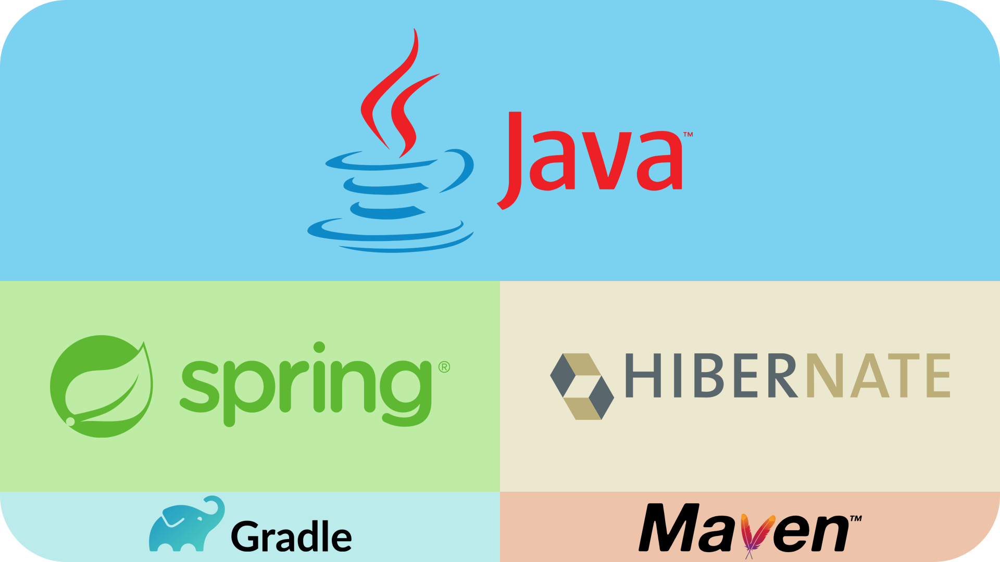
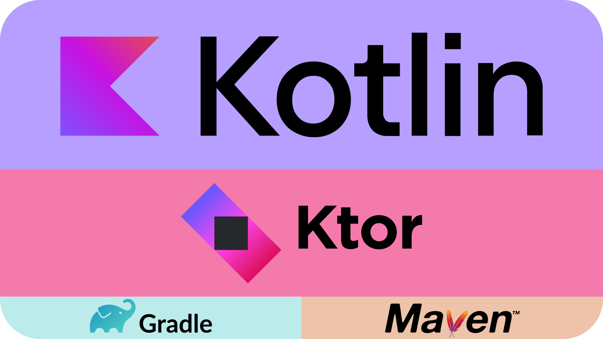
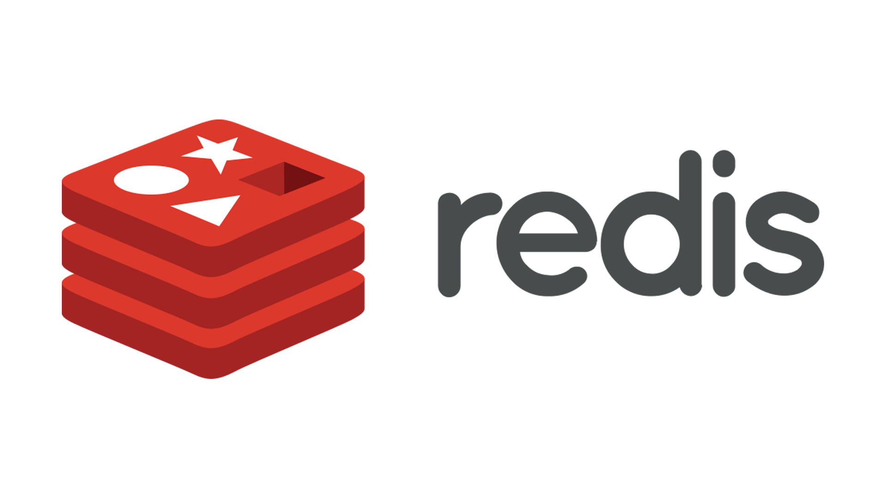
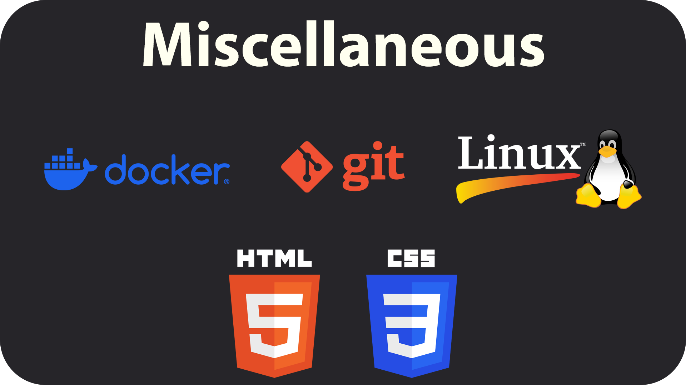

<h1>🌌 About me</h1>

	I have over 3 years of experience in object-oriented programming, with extensive work designing and building APIs and RESTful services.
	I’m experienced in system design, working with databases, and leveraging various tools to create efficient and maintainable solutions.
	Determined and methodical, I approach complex challenges thoughtfully, always seeking to understand deeply and continuously improve my work.

	I enjoy taking on challenging projects and working directly with clients to understand their needs, ensuring the systems I build meet their goals.
	I focus on writing readable, maintainable, and future-proof code that is reliable and resilient to errors.

 

📫 Contact me @ (Currently not available)

 

<h1>📚 My stack</h1>

  This section highlights the languages, databases, and tools I’m either strictly fluent in, or that I know well enough to use confidently. 
  I use these technologies to design scalable systems, build robust APIs, and implement maintainable solutions efficiently.

 

<h2>Languages</h2>

 <!-- 998 pixel limit -->
  
  

<h2>Databases</h2>

 <!-- 998 pixel limit -->
  
  

<h2>Miscellaneous</h2>

 <!-- 998 pixel limit -->
  

 

<h1>🎯 Current learning activities</h1>
<ul>
  <li>
	  Daily practice of Data Structures & Algorithms on <a href="https://leetcode.com/dennisz7">LeetCode</a> 
	  
  </li>
  <li>Currently learning SQL and comfortable in applying it effectively, will soon move on to PL/pgSQL, PL/SQL, and T-SQL.</li>
  <li>...</li>
</ul>
